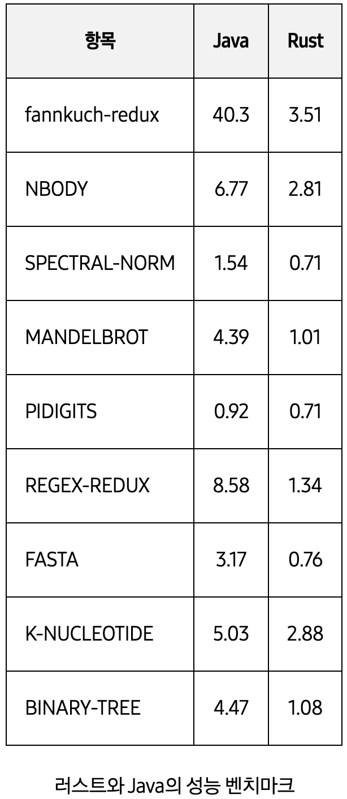

# 갑자기 어떤 경위로.. 무슨 Rust를 만지느냐

필자는 보안을 갖다버린 후 Java, Python 이외에는 크게 언어를 만진적이 없다. 심지어 익스또한 파이썬으로 짜기 때문에 읽는 것을 제외하고 작성하는 거셍서는 로우레벨 언어에 대한 애정이 정말 없었다.

하지만 Runtime Language가 주는 화려한 뒷북은 항상 기가막히게 나의 혈압을 올려왔기에 최근에 핫한 러스트는 야금야금 공부해오고 있었다.

2023년 중반기 MITS 연구실에 AI 연구원으로 들어가게 되었는데 학슴컴퓨터 발주의 문제(2024 4월에 온단다), Java를 할 줄 안다고 괜히 말했던 필자의 입 문제 등등이 겹쳐 Android기반 초음파 신호처리 개발에 투입되게 되었다.

<center>*내가 말한 Java는 분명 Spring을 떠올리고 한 말이였는데...*</center>


아무튼 그렇게 시작하게 된 Android 신호처리 리팩토링. (짜잔) <br>
해당 시스템에는 진짜 대단하면서도 간단한 문제가 있었는데... 버벅인다. 버벅버ㅓ겁겁겁걱....

레거시의 장애사항들을 기반으로 장애원인을 파악해보았다.
1. 신호처리 로직들이 굵직하게 4가지가 있는데, 해당 부분들은 모두 Vector자료형을 1024x720 픽셀 기준으로 상당히 많은 처리량을 요구한다.
2. 애초에 JVM 기반 로직 처리량이 그렇게 좋은 편이 아닌데... 너무 무리하게 AP를 갈구고 있었다.
3. 시리얼 통신, 신호 정규화, 신호 전처리, 송출까지 너무 많은 로직 동기식 수행이 성능이슈를 내고 있었다.

일단 가장 먼저 제시한건 Server-Side로 전환하는 것. Cuda 기반 병렬 처리나 단순 하드웨어 스케일 업으로 UDP 기반 서버통신으로 신호처리 로직을 이전하자고 하였는데... 교수님이 비 네트워크 환경에서의 웨어러블 고 이식성 초음파 신호처리의 가능성을 검증하고자 하는 프로젝트이기 때문에 안된다고 하셨다.

## 노답인가. 정말 노답인 것인가.
Java 레벨에서 쓰레드풀 문제, Android SDK의 잘못된 사용등 모두 고쳐보았으나 약간의 향상 뿐 근본적인 성능 문제는 뿌리 뽑을 수 없었기에 Server-Side 전환이 리젝 된 이상 앞이 참으로 캄캄했다.

결국 고성능 작업을 처리하는 Android앱의 사례들을 서칭하며 레퍼런스들을 차곡차곡 모았다.
수많은 최근 작업사례들을 종합적으로 평가해본 결과 최적의 기술을 찾게 되었다.
<br><br>
<center>러스트 이놈 기가 막힌데요 형님</center>


<center>*귀여운 미래의 간장게장*</center>

### 러스트로 개발하는 케이스는 무엇이 있을까
1. 고성능의 작업이 필요할 때 (방대한 리소스)
2. 빠른 작업처리가 필요할 때 (한정적인 리소스) ⭐️(이것이 필자가 맞이한 상황)⭐️
3. 임베디드, 안정적이고 경량화된 시스템이 필요할 때

등등으로 꼽을 수 있는데(서론이 길다..) 빠르고 가볍다는 장점을 사용해야 하는 이런 상황들을 제외하고도 이용할 수 있는 장점으로는 로우레벨 언어의 장점이라고 한다면 ffi 레벨에서 우위를 점할 수 있다는 장점역시 놓칠 수 없다.

## FFI가 무엇일까


필자는 구글링해서 나오는 내용 적는걸 참 싫어하기 때문에 간단히 설명하자면 하이레벨 언어가 로우레벨 언어의 함수를 사용할 수 있는 인터페이스를 제공하는 규격이다.

각 언어별로 ffi를 지원하는 방식은 각기 다르게 (대부분..?) 지원되고 있으며 예를 들어 Java의 JNI가 있다.

각 FFI 구현 방식에 따라 조금은 다르지만 일반적으로 `.dll`, `.dylib`, `.so` 확장자로 추출 된 파일을 import 해와서 사용하는 굵직한 방향으로 진행된다.

참고로 위 파일포맷들은 C, C++에서 공유 라이브러리, 동적 라이브러리라고 불리우는 컴파일 방식에서 얻어낼 수 있는 파일 포맷들로 당연하게도 로우레벨 언어에서 얻어낼 수 있는 공유 라이브러리 포맷이다.

### 짜잔 Rust 등장

Rust가 역시나도 위의 세가지 포맷들을 컴파일로서 모두 얻어낼 수 있는데, Samsung의 벤치기반으로 Rus로 작성된 공유 라이브러리의 Android 이식 성능이 꽤 좋은 지표인 걸 알 수 있다.

<center></center>

자세히 말하면 삼성이 만든 benchmarksgame-team1 의 Java와 러스트의 성능 비교 자료임.
일단 벤치만 봐도 근본적인 성능 문제를 해결할 수 있어 보이긴 한다.

## 만들어볼까나
일단 중요한 것은 Android에서 FFI를 어떻게 사용하는가. Android SDK 중 일부인 NDK(Native Development Kit)를 사용하여 로우레벨 코드를 사용할 수 있다.


JNI 라는 형식의 인터페이스 컨벤션을 지키면 (각 언어마다 조금 다름) NDK 를 통하여 실핼할 수 있는 환경이 만들어지는데, Rust에서는 아래와 같은 JNI 컨벤션이 있다.

```rust
use jni::objects::{JClass, JString}; //JNI 디펜던시. 각종 타입 포함.
use jni::sys::jstring;
use jni::JNIEnv;

#[no_mangle] // compiler 가 임의로 함수나 변수의 이름을 변경하지 않도록 함
pub extern "system" fn Java_HelloWorld_hello( 
    //Java의 HelloWorld Class에서 hello function 지정. 네이밍 컨벤션임.
    env: JNIEnv,
    _class: JClass,
    name: JString,
) -> jstring {
    // 이때부터 Rust pure function
    let input: String = env.get_string(name).unwrap().into();
    let greeting = format!("Hello, {input}!");
    let output = env.new_string(greeting).unwrap();
    output.into_inner()
}
```
참말로 복잡스럽다. 물론 불편함을 감내하고 그냥 때에 맞춰 하나하나 진행하면 될 것만도 같지만 필자의 경우 이런 상황이 너무 싫었다.


```java
class HelloWorld {
    private static native String hello(String name);

    static {
        // config에서 네이밍을 따로 맞춰주긴 해야한다.
        System.loadLibrary("hello_jni");
    }

    public static void main(String[] args) {
        String output = HelloWorld.hello("Alice");
        System.out.println(output);
    }
}
```
여기서 문제는 System 패키지에서 load를 진행하고 자체 Class에 계속 호출해가며 함수를 사용한다는 것도 여러개의 라이브러리를 사용하는 상황까지 고려했을 때 차라리 성능저하있는 애플리케이션을 쓰는 것이 정신건강에 나아 보였다.

